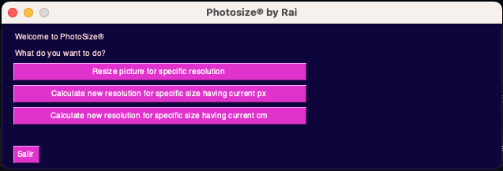
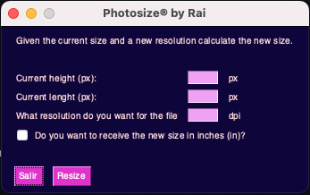

# PhotoSize Calculator

<div style="text-align: center">
   <p>Main view of the software.</p>
   
</div>


<div style="text-align: center">
<p>Introducind the data</p>
   
</div>


## Overview

PhotoSize Calculator is a desktop software designed to make resizing images a breeze. Whether you have image dimensions in pixels or centimeters and need to adjust the scale or DPI (dots per inch), this tool has got you covered. It provides quick and intuitive calculations, making image resizing a straightforward process.

## Features

- Calculate new image dimensions based on pixels or centimeters.
- Easily adjust the scale or DPI.
- Convert measurements between inches and centimeters.
- User-friendly and intuitive interface.

## Requirements

Before running PhotoSize Calculator, ensure you have the following prerequisites:

- [Python](https://www.python.org/) 3.x or higher
- [PySimpleGUI](https://www.pysimplegui.org/)

## Getting Started

To start using PhotoSize Calculator, follow these simple steps:

Clone this repository to your local machine:

```bash
$ git clone https://github.com/jrdelrio/photosize.git
$ cd photosize
```

Run the main file!

```bash
$ python3 Photosize.py
```

## Usage

1. Launch the application.
2. Input the current image dimensions in pixels or centimeters.
3. Adjust the scale or DPI as needed.
4. The software will calculate and display the new image dimensions in inches or centimeters.
5. Enjoy effortless image resizing!

## Acknowledgments

Special thanks to PySimpleGUI for providing a user-friendly GUI library for Python.

I hope you find PhotoSize Calculator helpful for your image resizing needs!

Happy resizing!
